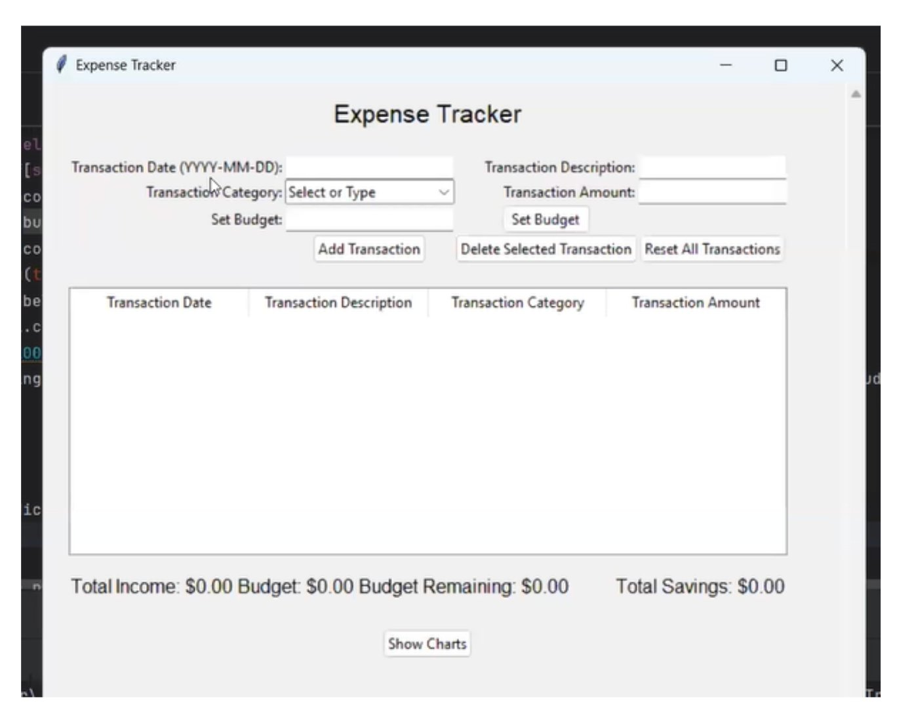
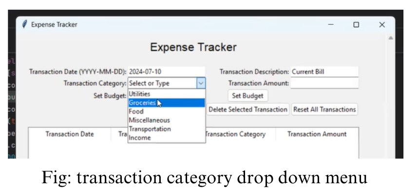
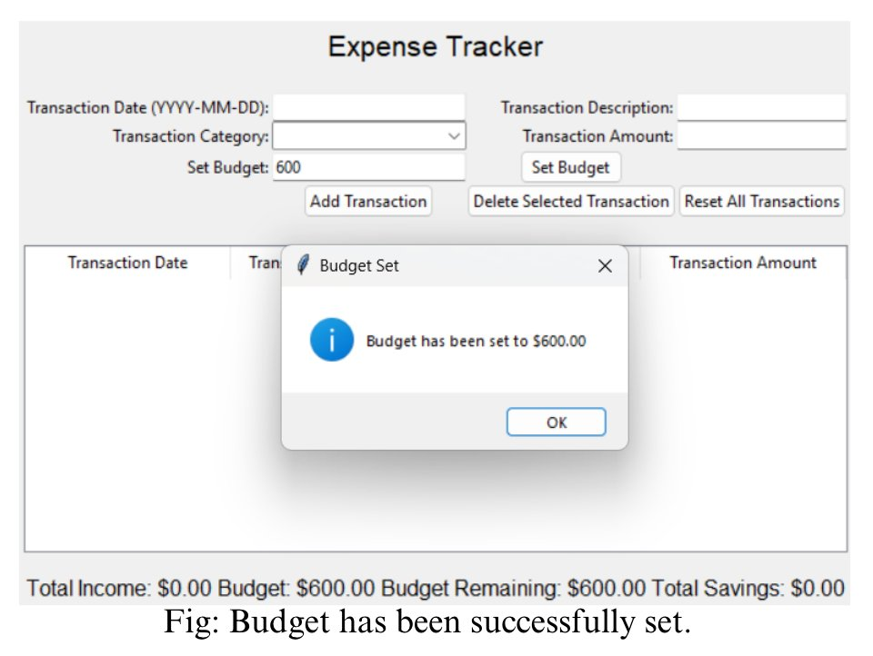
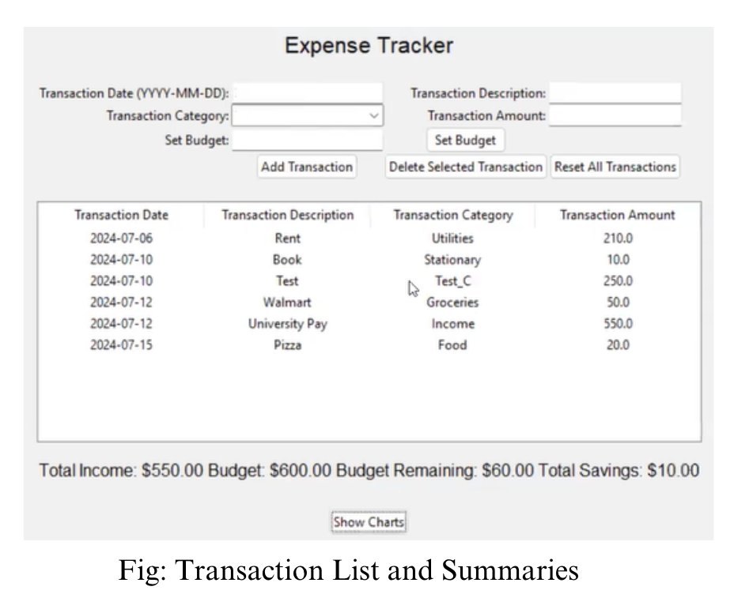
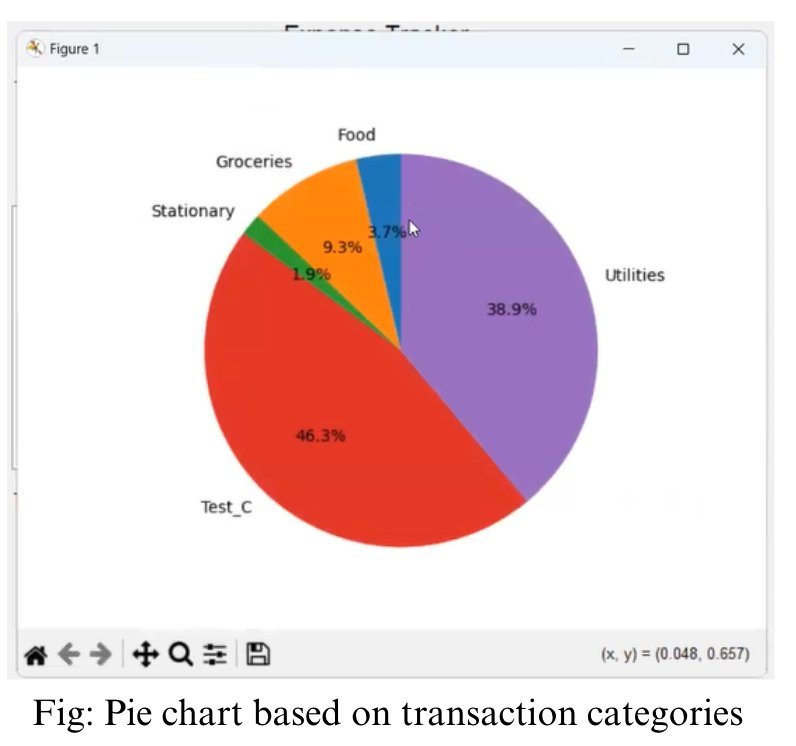
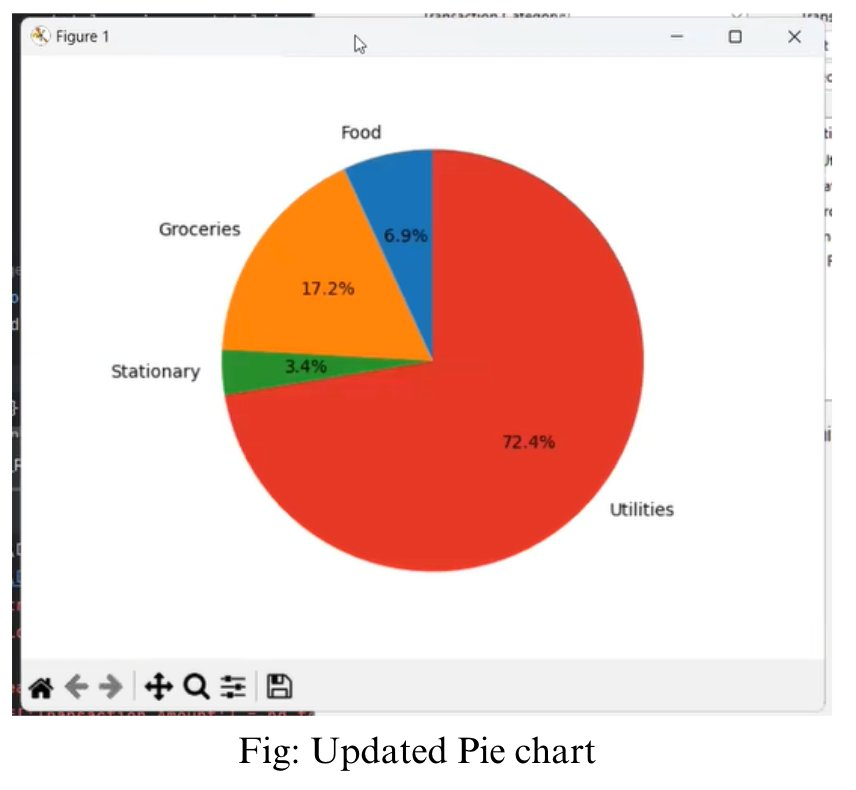
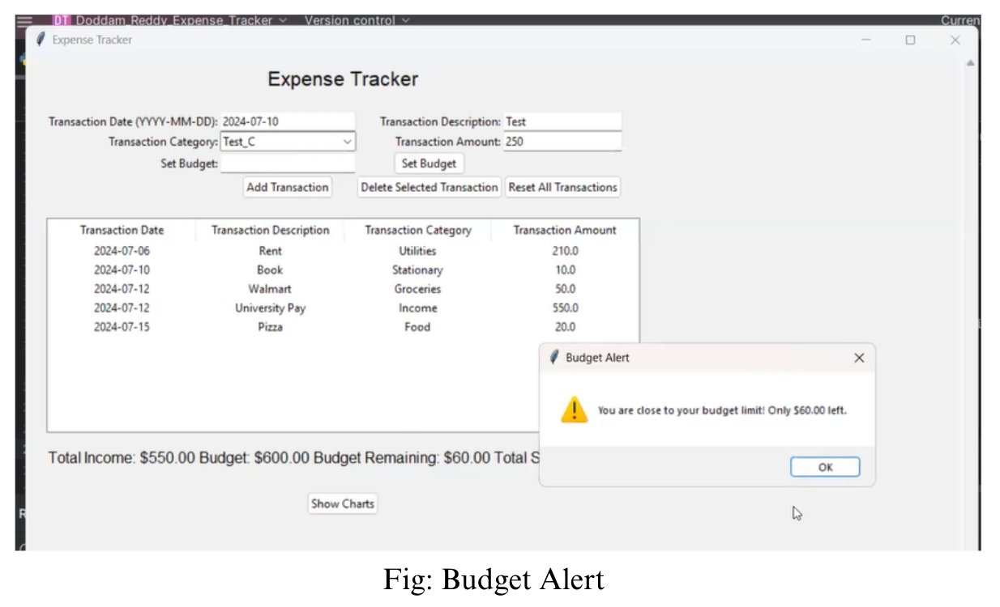
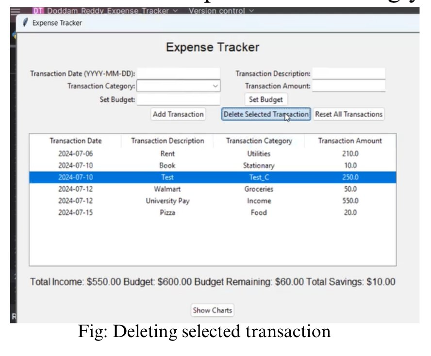
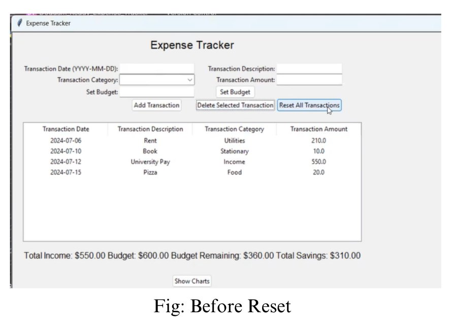
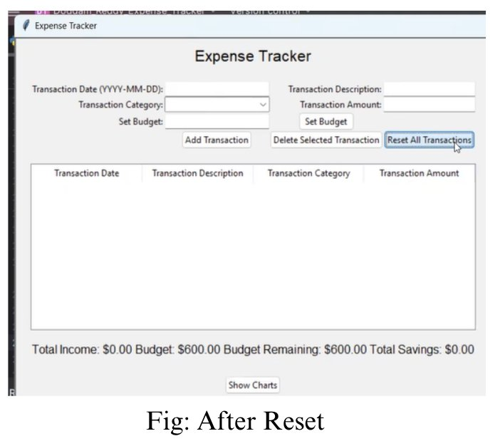

# Expense Tracker

A desktop expense tracking application built with Python. Handles transaction management, budget tracking, financial summaries, and spending visualization.

## What it does

- Add, delete, and reset expense and income transactions
- Set a monthly budget and track remaining balance in real time
- View total income, total expenses, savings, and budget status
- Visualize spending by category with pie charts
- All data persists between sessions using local file storage

## Screenshots

### Application launch
The app starts with an empty transaction table and all financial values at zero. The category dropdown includes preset options (Utilities, Groceries, Food, Miscellaneous, Transportation, Income) and also accepts custom categories typed in directly.

<p align="center">
  
</p>

<p align="center">
  
</p>

### Setting a budget
Users enter a budget amount and click "Set Budget." The app validates the input and shows a confirmation dialog. Non-numeric input triggers an error message.

<p align="center">
  
</p>

### Transaction management
Transactions appear in a sortable table with running financial summaries at the bottom. The app calculates total income, total expenses, remaining budget, and net savings in real time after every change.

<p align="center">
  
</p>

### Expense visualization
Clicking "Show Charts" generates a pie chart of expenses grouped by category. Income transactions are excluded from the chart. The chart updates as transactions are added or removed.

<p align="center">
  
  
</p>

### Budget alerts
When remaining budget drops below $100, the app shows a warning dialog. This fires automatically whenever a transaction pushes the balance into the warning zone.

<p align="center">
  
</p>

### Deleting transactions
Select a row in the table and click "Delete Selected Transaction" to remove it. Financial summaries recalculate immediately.

<p align="center">
  
</p>

### Reset
"Reset All Transactions" clears the table and resets all financial values. Budget amount is preserved.

<p align="center">
  
  
</p>

## How it works

The application uses a single-class OOP architecture that manages three responsibilities: the UI layer (tkinter), the data layer (Pandas DataFrames), and the storage layer (pickle serialization).

Transactions are stored in a Pandas DataFrame during runtime. On close, the full state (transactions + budget) is serialized to disk. On launch, it deserializes and rebuilds the UI from saved state. If the data file is missing or corrupted, the app falls back to an empty state instead of crashing.

Financial calculations run on every state change. Adding a transaction, deleting one, or setting a new budget triggers a full recalculation of income, expenses, savings, and remaining budget. The budget alert fires when remaining balance drops below $100.

## Tech stack

- **Python 3** - core language
- **tkinter** - GUI framework
- **Pandas** - data processing, aggregation, and filtering
- **Matplotlib** - expense category visualization

## Running it

```bash
pip install pandas matplotlib
python expense_tracker.py
```

Python 3.8+ required. tkinter ships with most Python installations.

## Project structure

```
expense-tracker/
├── README.md
├── requirements.txt
├── expense_tracker.py
├── screenshots/
│   ├── app_launch.png
│   ├── category_dropdown.png
│   ├── budget_set.png
│   ├── transaction_list.png
│   ├── pie_chart.png
│   ├── updated_pie_chart.png
│   ├── Budget_alert.png
│   ├── delete_transaction.png
│   ├── before_reset.png
│   └── after_reset.png
├── .gitignore
└── LICENSE
```

## Design notes

**Why pickle instead of SQLite?** This was scoped as a single-user desktop tool for a course project. Pickle was the simplest path to session persistence without adding a database dependency. For anything multi-user or networked, I'd use PostgreSQL (which is what I work with at my day job).

**Why a single class?** The app is small enough that splitting into MVC would add complexity without real benefit. The class handles ~200 lines total. If I were extending this, I'd separate the data layer from the UI.

**Error handling approach:** Every user input path has validation. Date parsing, numeric conversion, and empty field checks all fail with specific error messages rather than silent failures or crashes.

## What I'd change if I rebuilt this

- Swap pickle for SQLite or PostgreSQL for proper data storage
- Add a REST API layer (FastAPI) and separate the backend from the UI
- Add filtering by date range and search by description
- Export reports to CSV or PDF
- Add recurring transaction support
- Write unit tests for the financial calculation logic

## Author

Sai Pavan Reddy Doddam Reddy
- [LinkedIn](https://www.linkedin.com/in/sai-pavan09)
